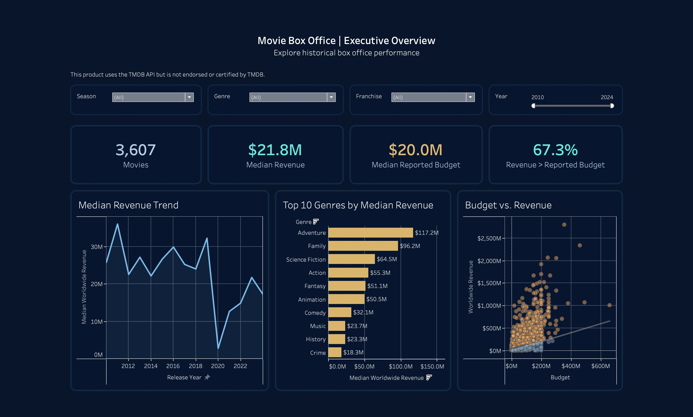
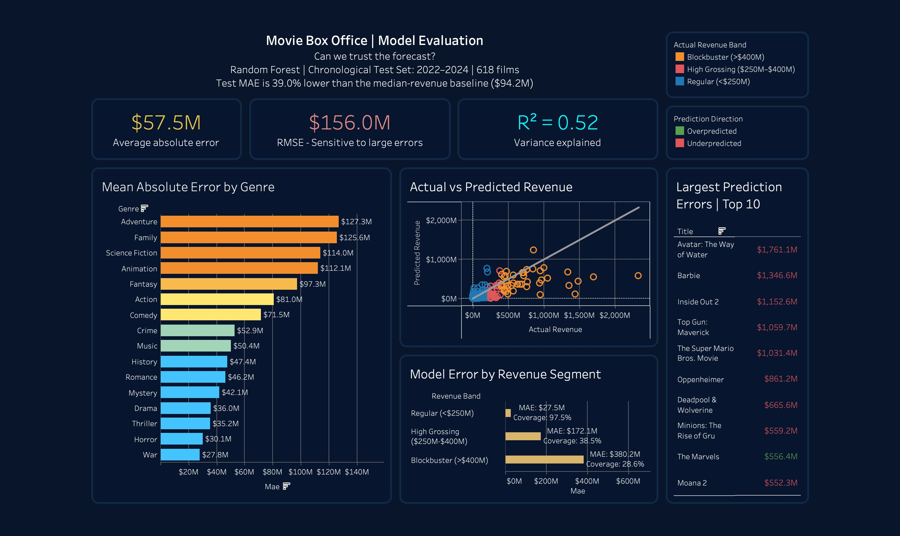
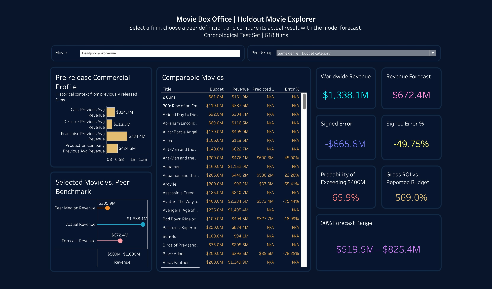

# Box Office Revenue Prediction

[](https://github.com/shani-ifrach/boxoffice-revenue-prediction/actions/workflows/ci.yml)

A portfolio project combining Python data analysis, machine learning and a Tableau
dashboard. It estimates worldwide movie revenue and separately
scores the likelihood of exceeding $400M and reported revenue exceeding budget.

The main contribution is a consistent analytical workflow: financial data cleaning,
strictly prior entity history, temporal validation, shared training/inference
features, and clear reporting of both model performance and limitations.

## Results and business findings

The dataset contains **3,607 films released in 2010–2024**. Random Forest was selected
by mean MAE across three expanding temporal validation windows. On the separate
2022–2024 evaluation set (**618 films**), it achieved:

| Metric | Random Forest | Development-median baseline |
|---|---:|---:|
| MAE | **$57.5M** | $94.2M |
| RMSE | $156.0M | $237.4M |
| R² | 0.519 | -0.113 |

The model reduced MAE by **38.9%**. Errors are much smaller for films below $250M
($27.5M MAE) than for blockbusters above $400M ($380.2M MAE). This is a useful
commercial-scale signal, with substantial limitations for exceptional hits.

The calibrated $400M classifier achieved **81.0% recall**, **59.6% precision** and
**76.6% PR-AUC**. Its validation-selected threshold is 0.065. Only 42 of the 618
evaluation films are blockbusters, so accuracy alone is misleading.

A nominal 90% empirical interval based on rolling-validation residuals covered
90.3% of evaluation outcomes. Coverage for blockbusters was only 28.6%; overall
coverage does not imply dependable coverage for every segment.

See [final report](reports/final_report.md) for the analysis and
[model card](docs/model_card.md) for evaluation details.
An [exploratory revenue-model comparison](docs/model_comparison.md) documents later
tests of additional model families and how to reproduce them.

## Tableau dashboard

The dashboard contains **Executive Overview**, **Movie Explorer**, and
**Revenue Model Evaluation**.

**[View the interactive dashboard on Tableau Public](https://public.tableau.com/app/profile/shani.ifrach4420/viz/BoxOfficeRevenuePrediction-AnalysisModelEvaluation/ExecutiveOverview)**

Download and open the final workbook in Tableau:
[boxoffice_dashboard.twbx](dashboard/tableau/boxoffice_dashboard.twbx).
See [dashboard guide](dashboard/README.md) for the pages and interpretation.

The pipeline produces cleaned data, evaluation tables and charts. The final
workbook and its active CSV sources are preserved when the pipeline runs.

## Workflow

```text
TMDB extracts -> deduplication -> cleaning -> shared strict-date features
              -> temporal model selection -> saved models -> evaluation + EDA
              -> validated analytical tables

Tableau dashboard <- saved analytical outputs
```

- 791 films have no valid positive budget. They remain eligible for revenue models
  and history, but profitability and ROI stay unknown.
- Historical rows must have an earlier release date; films released on the same
  day never see each other's outcomes.
- Directors, cast, companies and franchises use stable TMDB IDs where available.
- Training and prediction share a feature builder and an ordered 35-feature contract.
- Missing numeric values are imputed within fitted preprocessing; unseen categories
  are handled safely.
- Model families and thresholds use development validation. Older exploratory
  stability outputs included final-period comparisons, so the project makes no
  claim that this evaluation period has never been inspected. The current stability
  script uses development validation only. See [limitations](docs/limitations.md).

## Install and run an offline prediction

Use **Python 3.12–3.14**; the pinned NumPy version requires at least 3.12. CI is
configured for these versions; local verification used Python 3.14.3.

```bash
python -m venv .venv
.venv/bin/pip install -r requirements.txt
.venv/bin/python -m unittest discover -s tests -v
.venv/bin/python -m src.predict --record-json examples/movie_record.json
```

The repository includes processed data in `data/processed`, the final trained
models in `models/reduced`, and a fully synthetic sample movie record. The tests and offline
prediction do not require a TMDB API key or the original raw extracts. These
commands use the Python environment layout for macOS/Linux; on Windows the virtual
environment's Python executable is `.venv\Scripts\python.exe`.

Prediction returns revenue, an empirical interval, calibrated blockbuster
probability and the saved classification threshold. The example contains no
TMDB-sourced movie record, and any current-film outcomes are discarded by the
feature builder.

## Reproduce the complete pipeline

The original timestamped TMDB response files are not committed or distributed.
A complete merge-to-model reconstruction requires an authorized local collection.
If those extracts are available locally, place them under `data/raw`, then run:

```bash
MPLBACKEND=Agg .venv/bin/python -m src.run_pipeline
```

This retrains the models and regenerates analytical outputs. The portfolio review
archive contains no `data/raw` files. A new API collection requires `TMDB_API_KEY`
and may produce a different dataset and results. See the
[reproducibility guide](docs/reproducibility.md) for the distinction between
saved-model review and full reconstruction.

Original TMDB API responses remain local and are excluded from Git and from the
portfolio review archive.

The final pipeline trains the **35-feature model** and writes model artifacts to
`models/reduced`, processed data to `data/processed`, and analysis tables/charts to
`reports`. The tables are the direct outputs of cleaning and evaluation; no extra
CSV export layer is required. Prediction and evaluation tables are validated before
the run reports success.

The 38-feature list remains in the feature-ablation analysis to document the choice
of the reduced feature set; it is not a second model needed for dashboard use.

For a live TMDB lookup, set `TMDB_API_KEY` and use `--tmdb-id` instead of
`--record-json`.

## Code and documentation

- `src/collect_tmdb.py`, `merge_raw_extracts.py`, `data_cleaning.py`: data ingestion,
  source coverage, deduplication and financial validity rules.
- `src/feature_engineering.py`: shared strictly prior historical features.
- `src/train_model.py`, `predict.py`: temporal model selection and compatible inference.
- `src/evaluate_models.py`, `eda.py`: segmented error analysis and descriptive findings.
- `src/data_quality.py`: financial data profiles and analytical output validation.
- `src/feature_ablation.py`, `feature_stability.py`: development-only comparisons.
- `docs`: architecture, contracts, reproducibility, tests and limitations.
- [Decision log](notes/decision_log.md): rationale for the main data, validation and
  modeling choices.

## Limits

TMDB is a visibility-biased sample of current records, rather than historical
snapshots of everything known before release. History begins in 2010; budgets are
incomplete; marketing, release width and distribution economics are unavailable.
Worldwide gross above budget is not accounting profit. Empirical intervals have no
formal coverage guarantee under this temporal workflow.

## Data source attribution

[](https://www.themoviedb.org)

This product uses the TMDB API but is not endorsed or certified by TMDB. The logo
above is an unmodified approved TMDB asset.




